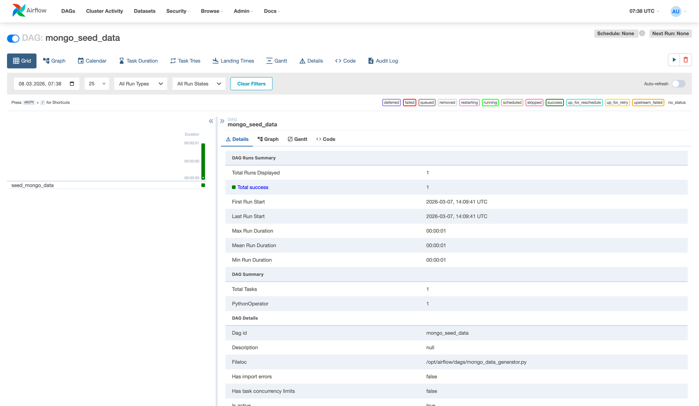
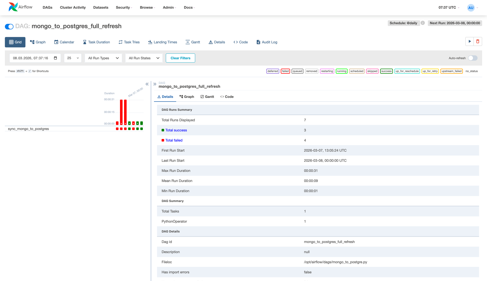
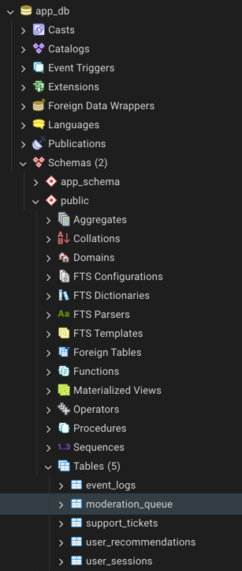
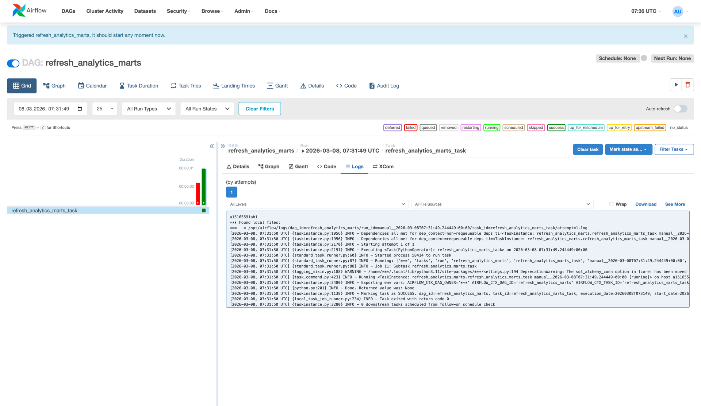
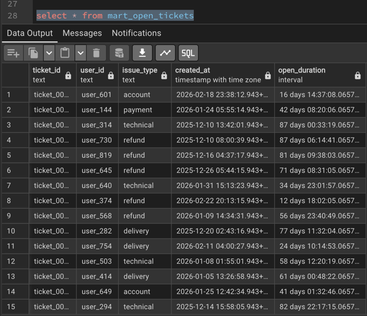
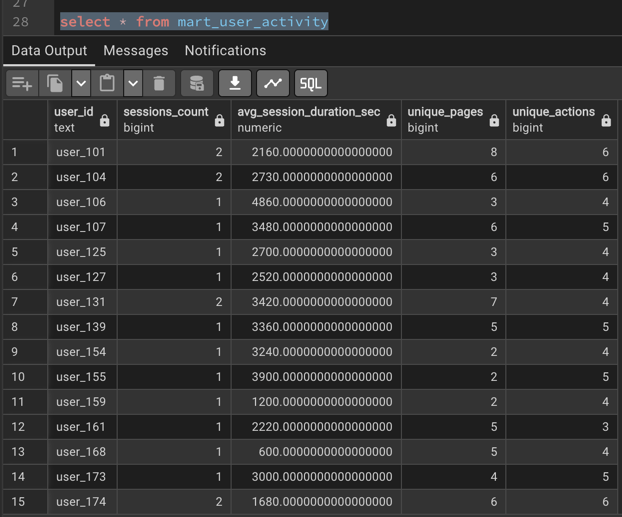

# ETL Final Task

Итоговое задание по модулю **ETL-процессы**.

В проекте реализован ETL-pipeline:

```
MongoDB → PostgreSQL → аналитические витрины
```

Все сервисы запускались локально в Docker.

---

# Структура проекта

```
ETL
└── final_task
    ├── schemas
    │   ├── eventlogs.json
    │   ├── moderationqueue.json
    │   ├── supporttickets.json
    │   ├── userrecommendations.json
    │   └── usersessions.json
    │
    ├── screenshots
    │   ├── img_mongo_data_generator.png
    │   ├── img_mongo_to_postgre.png
    │   ├── img_refresh_analytics_marts.png
    │   ├── img_postgre_tables.png
    │   ├── img_mart_1.png
    │   └── img_mart_2.png
    │
    ├── SQL
    │   └── data_marts.sql
    │
    ├── mongo_data_generator.py
    ├── mongo_to_postgre.py
    ├── refresh_analytics_marts.py
    └── README.md
```

---

# Источник данных (MongoDB)

В MongoDB генерируются следующие коллекции:

| Коллекция           | Описание                  |
| ------------------- | ------------------------- |
| UserSessions        | пользовательские сессии   |
| EventLogs           | события пользователей     |
| SupportTickets      | обращения в поддержку     |
| UserRecommendations | рекомендации товаров      |
| ModerationQueue     | очередь модерации отзывов |

JSON-схемы документов находятся в папке:

```
schemas/
```

---

# DAG 1 — Генерация данных

Файл:

```
mongo_data_generator.py
```

DAG **mongo_seed_data** генерирует тестовые данные и записывает их в MongoDB

Пример выполнения DAG:



---

# DAG 2 — Репликация данных

Файл:

```
mongo_to_postgre.py
```

DAG **mongo_to_postgres_full_refresh** выполняет загрузку данных из MongoDB в PostgreSQL

Основные этапы:

1. чтение данных из MongoDB
2. преобразование структуры данных
3. батчевая запись в PostgreSQL

После загрузки создаются таблицы:

```
user_sessions
event_logs
support_tickets
user_recommendations
moderation_queue
```

Пример выполнения DAG:



Созданные таблицы PostgreSQL:



---

# DAG 3 — Построение аналитических витрин

Файл:

```
refresh_analytics_marts.py
```

DAG **refresh_analytics_marts** пересчитывает аналитические витрины в PostgreSQL

Пример выполнения DAG:



SQL-код создания витрин находится в файле:

```
SQL/data_marts.sql
```

---

# Аналитические витрины

## mart_user_activity

Витрина активности пользователей

Метрики:

* количество сессий
* средняя длительность сессии
* количество уникальных страниц
* количество действий пользователя

Пример запроса:

```sql
SELECT * FROM mart_user_activity;
```

Результат:



---

## mart_support_statistics

Витрина эффективности работы поддержки

Метрики:

* количество обращений
* статус тикетов
* тип проблемы
* среднее время решения

Пример запроса:

```sql
SELECT * FROM mart_support_statistics;
```

Результат:



---

# Pipeline

Общий pipeline выглядит следующим образом:

```
mongo_seed_data
        ↓
mongo_to_postgres_full_refresh
        ↓
refresh_analytics_marts
```
